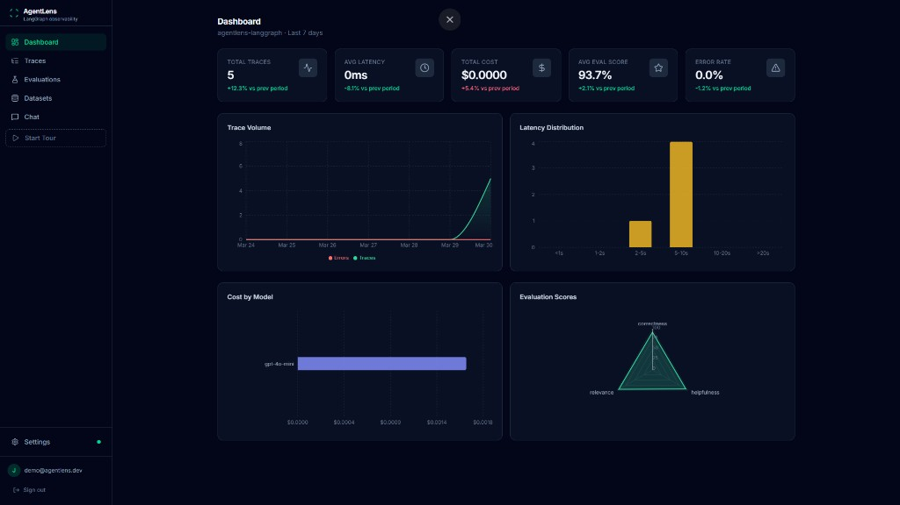
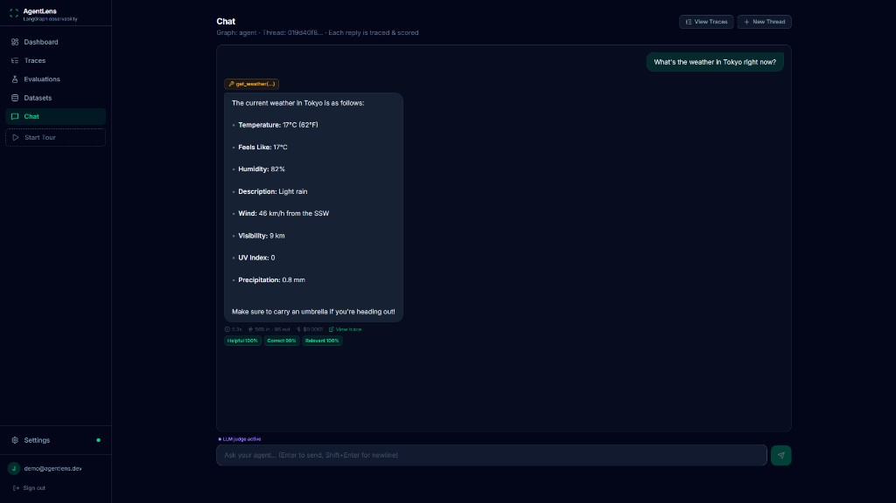
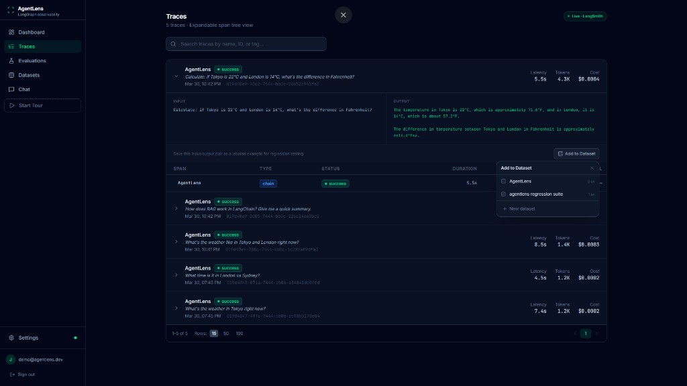
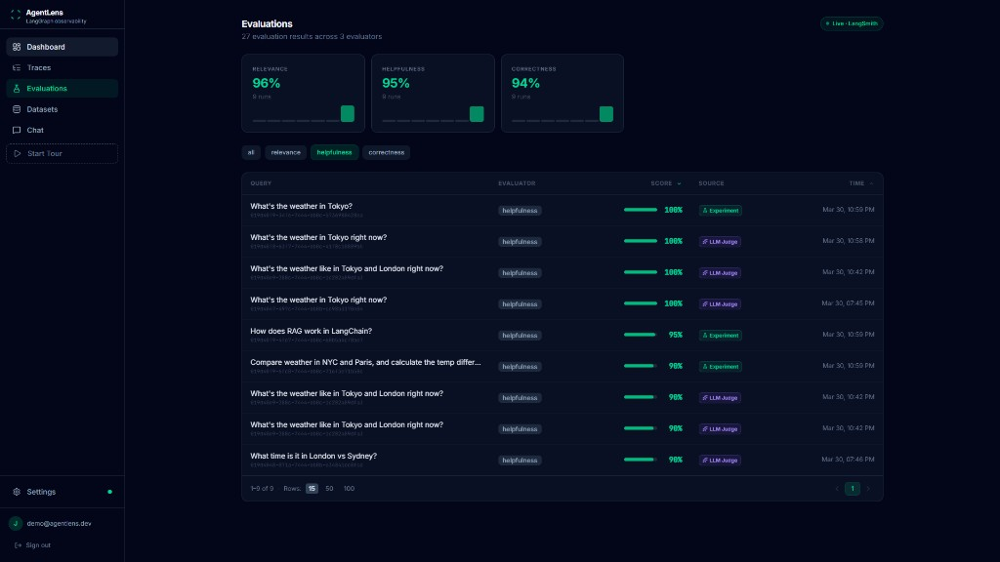
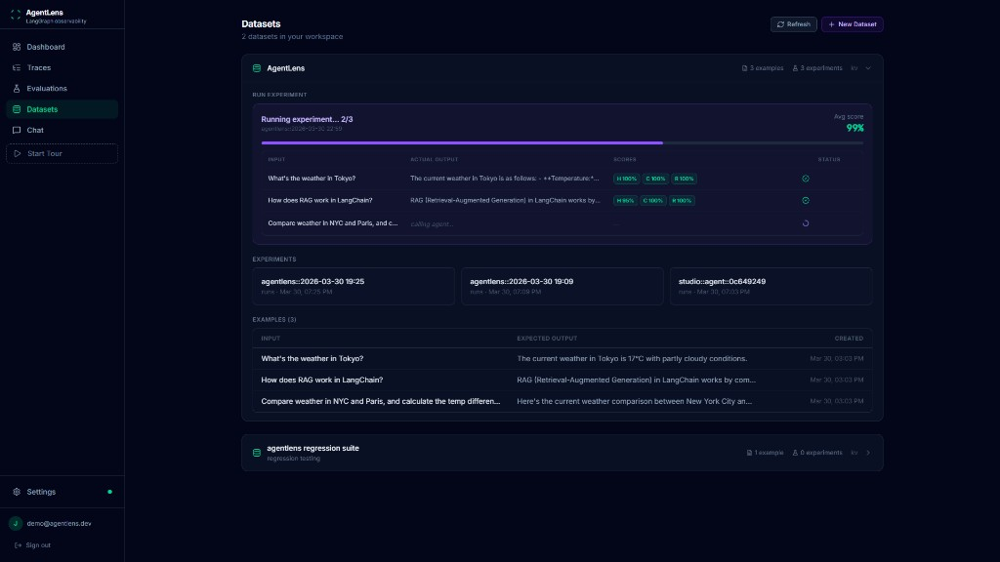
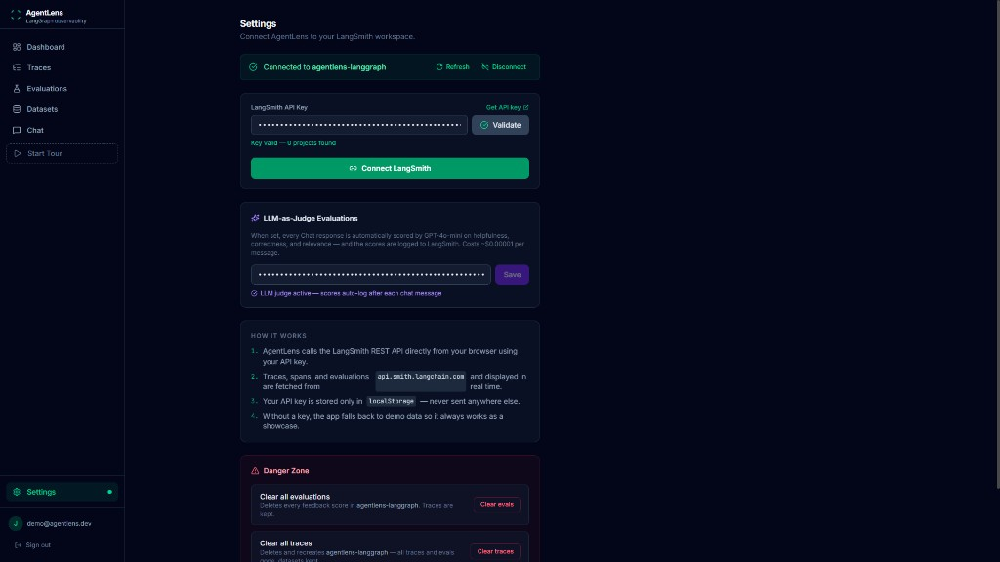

# AgentLens

An observability dashboard I built to get hands-on with the LangChain ecosystem - LangSmith, LangGraph, and the patterns around evaluating LLM applications.

The app connects to a real LangSmith workspace and a local LangGraph agent. You can chat with the agent, see every trace logged in real time, run LLM-as-judge evaluations, manage datasets, and execute experiments - all from one interface.

I built this to learn the stack end-to-end, not as a production tool. It covers the parts of LangChain I wanted to understand deeply: how traces flow through LangSmith, how feedback and evaluations work at the API level, how LangGraph structures agent execution, and what it takes to wire all of that into a responsive frontend.

## Screenshots

### Dashboard



Live KPI cards and charts sourced from LangSmith session stats. Updates as the agent runs.

### Chat



Talk to a local LangGraph agent. Each reply shows latency, tokens, cost, and a link to its trace. GPT-4o-mini scores every response inline.

### Traces



Searchable trace list with expandable span trees. "Add to Dataset" saves any trace as a labeled example.

### Evaluations



LLM-judge scores with source badges, 7-day trend sparklines, and sortable/filterable table.

### Datasets and Experiments



Browse LangSmith datasets, view examples, and run experiments that send each example through the agent and score the results.

### Settings



API key management and a danger zone for clearing data when you want a fresh start.

---

## What I learned building this

**LangSmith's REST API is the real interface.** The SDK is convenient, but building the fetch client from scratch (`src/utils/langsmith.ts`) taught me how runs, feedback, sessions, and datasets actually relate to each other at the HTTP level. Rate limiting (429s) is real - I had to add exponential backoff and a shared TTL cache across hooks.

**LangGraph's execution model is clean.** The `/runs/wait` endpoint gives you synchronous agent calls without SSE parsing. One gotcha: the `run_id` for LangSmith isn't always in the response body, so I fetch it from `/threads/{id}/runs?limit=1` afterward for feedback logging.

**LLM-as-judge is surprisingly practical.** A single `gpt-4o-mini` call at `temperature: 0` returns structured JSON scores for about $0.00001 per evaluation. I use the same evaluator for both chat messages and dataset experiments.

**The adapter layer matters.** LangSmith returns raw run objects in three different serialization formats depending on whether the agent used the Python SDK, LangChain JS, or plain OpenAI. `src/utils/adapters.ts` normalizes all of them into typed UI models.

---

## Running it locally

You need two terminals - one for the dashboard, one for the agent.

### 1. Start the dashboard

```bash
npm install
npm run dev
```

Open [http://localhost:5173](http://localhost:5173). The app runs in demo mode with mock data until you add API keys.

### 2. Add API keys in Settings

Open Settings (bottom of the left nav) and paste:

| Key | Where to get it |
|-----|-----------------|
| **LangSmith API key** | [smith.langchain.com/settings](https://smith.langchain.com/settings) |
| **OpenAI API key** | [platform.openai.com/api-keys](https://platform.openai.com/api-keys) |

Once the LangSmith key is saved, Dashboard, Traces, Evaluations, and Datasets switch to live data automatically.

The OpenAI key enables LLM-as-judge - without it, Chat still works but no eval scores are generated.

### 3. Start the LangGraph agent (enables Chat)

The Chat page needs a LangGraph agent at `localhost:2024`. In a second terminal:

```bash
cd langgraph-agent
npm install
```

Create `langgraph-agent/.env` (see `.env.example`):

```
LANGSMITH_TRACING=true
LANGSMITH_ENDPOINT=https://api.smith.langchain.com
LANGSMITH_API_KEY=your_key_here
OPENAI_API_KEY=your_key_here
```

Then start the server:

```bash
npx @langchain/langgraph-cli dev
```

When you see `Ready on http://localhost:2024`, go back to the dashboard and open Chat.

The agent is a `createReactAgent` graph with five tools: weather (wttr.in), web search (DuckDuckGo), calculator, date/time, and a curated knowledge base.

> Traces, Evaluations, Datasets, and Dashboard work without this step. Only Chat needs the local agent.

### 4. Take the tour (optional)

Click **Start Tour** in the left nav. It sends three messages to the agent automatically, then walks through every page. Takes about 3 minutes.

---

## Running tests

```bash
npm run test:run
```

58 tests covering the data adapter pipeline and UI components.

---

## Tech stack

**Frontend:** React 19, TypeScript, Vite, Tailwind CSS v4, SCSS, Recharts, React Router v7, Sonner, Vitest

**LangChain ecosystem:** LangSmith REST API (traces, feedback, sessions, datasets, experiments), LangGraph JS (`createReactAgent` + `langgraph-cli`), LangGraph SDK (threads, `/runs/wait`)

**Evaluation:** OpenAI GPT-4o-mini as LLM-as-judge - scores helpfulness, correctness, and relevance as structured JSON, posted to LangSmith as feedback

---

## How it works

**Vite proxy for CORS** - LangSmith rejects browser requests. The dev server proxies `/langsmith/*` to `api.smith.langchain.com`. In production this would be a serverless edge function.

**Shared TTL cache** - A module-level `Map` in `useLangSmithData.ts` with 5-minute TTL. A version counter + listener pattern lets `invalidateCache()` trigger all mounted hooks to refetch simultaneously.

**Adapter layer** - `adapters.ts` transforms raw LangSmith run objects into typed UI models (`Trace`, `Span`, `EvalResult`). Components never see raw API shapes.

**Tour orchestration** - `localStorage` queue + `CustomEvent` coordination between `useTutorial.ts` and `ChatPage.tsx`. Messages are sent sequentially, each waiting for the full response and eval score before the next fires.

---

## Project structure

```
src/
  contexts/         Auth and LangSmith API key state (localStorage)
  hooks/            useLangSmithData (cache + fetch) and useTutorial (tour)
  pages/            Dashboard, Traces, Evaluations, Datasets, Chat, Settings
  utils/
    langsmith.ts    Typed fetch client with retry/backoff/TTL cache
    langgraph.ts    LangGraph client (runAndWait, thread management)
    evaluator.ts    LLM-as-judge (GPT-4o-mini structured JSON)
    adapters.ts     Raw API shapes to UI types
    format.ts       Duration, cost, number formatters
  components/       Layout, Charts, Pagination, UI primitives
  styles/           SCSS tokens, animations, component overrides
  test/             Vitest unit + component tests

langgraph-agent/    TypeScript LangGraph ReAct agent (5 tools)
```

---

## License

MIT
